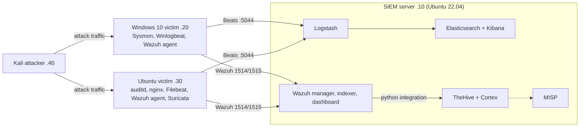

# SOC Home Lab

[](https://github.com/EduardoRochaFernandes/soc-home-lab/actions/workflows/ci.yml)
[](LICENSE)


[](https://codespaces.new/EduardoRochaFernandes/soc-home-lab)

**An open-source SOC home lab design: Wazuh, ELK, Suricata, TheHive, Cortex and MISP on four VMs, with step-by-step setup guides,
detection rules mapped to MITRE ATT&CK, runbooks and attack-simulation playbooks.**

A first-year degree project in cybersecurity. It is a **documented design plus working detection content and tooling**, not a
packaged product. A full SOC stack needs 24-32 GB of RAM and several VMs, so it cannot run in a Codespace or in `docker compose`.
What you can run with one click is the part that does not need the VMs: validate the detection rules and try the IOC enricher.

## Try it in one click (no VMs needed)

1. Open the repository in a Codespace: [codespaces.new/EduardoRochaFernandes/soc-home-lab](https://codespaces.new/EduardoRochaFernandes/soc-home-lab)
2. The dev container installs the dependencies and runs the offline IOC enricher demo automatically.
3. Then, in the terminal:

```bash
make check     # yamllint + ruff + pytest + Sigma validation/conversion (what CI runs)
make demo      # IOC enricher on bundled synthetic data: no API keys, no network
```

Locally you only need Python 3.11+ and `make` (run `make setup` first, which does `pip install -r requirements-dev.txt`).

## What is in this repository

| Area | What exists | Where |
|------|-------------|-------|
| Architecture | Overview with Mermaid diagrams, ports, data flow, ADRs | [docs/architecture/](docs/architecture/01-overview.md) |
| Setup guides | 8 ordered guides: hypervisor, SIEM host, Wazuh, ELK, Suricata, TheHive/Cortex/MISP, Windows and Linux agents | [docs/setup/](docs/setup/) |
| Detection rules | 4 Sigma rules, 14 Wazuh rules, 12 Suricata rules, Elastic queries | [detections/](detections/), [catalog](docs/detections/catalog.md) |
| Runbooks | SSH brute force, suspicious PowerShell | [docs/runbooks/](docs/runbooks/) |
| Simulations | Manual playbooks for SSH brute force and encoded PowerShell | [simulations/manual/](simulations/manual/) |
| Threat intel | MISP feed notes | [threat-intel/](threat-intel/misp-feeds.md) |
| Tooling | `ioc-enricher` (AbuseIPDB, Shodan, VirusTotal) with an offline demo mode; Ansible playbook for Wazuh Linux agents | [tools/](tools/ioc-enricher/), [infrastructure/](infrastructure/) |

## Architecture



All VMs sit on a host-only network `192.168.56.0/24`. Details, port table and known inconsistencies:
[docs/architecture/01-overview.md](docs/architecture/01-overview.md).

## Hardware requirements

| Resource | Minimum (architecture doc) | Recommended (setup guide 01) |
|----------|---------------------------|------------------------------|
| RAM | 24 GB | 32 GB |
| CPU | 6 cores | 8 cores |
| Disk | 200 GB SSD | 500 GB SSD |

Planned VM allocation: SIEM 12 GB / 4 vCPU / 100 GB, Windows victim 4 GB / 2 / 60 GB, Linux victim 2 GB / 2 / 40 GB,
Kali 4 GB / 2 / 60 GB. These are design estimates; the lab has not been benchmarked.

## Setup (on your own hardware)

Follow the guides in order. Each ends with a validation checklist.

1. [Hypervisor and VMs (VirtualBox or Proxmox)](docs/setup/01-proxmox-setup.md)
2. [SIEM server preparation](docs/setup/02-siem-server.md)
3. [Wazuh manager](docs/setup/03-wazuh-install.md)
4. [Elasticsearch, Logstash, Kibana](docs/setup/04-elk-install.md)
5. [Suricata](docs/setup/05-suricata-install.md)
6. [TheHive, Cortex, MISP](docs/setup/06-thehive-misp.md)
7. [Windows agents](docs/setup/07-agents-windows.md)
8. [Linux agents](docs/setup/08-agents-linux.md)

API keys and tokens are never committed: copy [`.env.example`](.env.example) to `.env` for the Python tools.

## Detection use-cases

| Use-case | ATT&CK | Sigma | Wazuh | Suricata |
|----------|--------|-------|-------|----------|
| SSH brute force | T1110.001 | SOC-050 | 100050, 100051 | 9000001 |
| Encoded PowerShell | T1059.001 | SOC-010 | - | - |
| Windows event log cleared | T1070.001 | SOC-040 | - | - |
| Mimikatz / LSASS access | T1003.001 | SOC-051 | - | - |
| Credential file access, sudo abuse, cron/SSH-key persistence, reverse shells | various | - | 100012-100052 | - |
| Network scanning, C2 ports, DNS tunnelling, web attacks | T1046, T1071, T1048.003, T1190 | - | 100060 | 9000010-9000070 |

Full list, the planned-but-unwritten rules, and validation status: [Detection Catalog](docs/detections/catalog.md).

Example: the log-clearing Sigma rule converted to an Elasticsearch query by `make sigma`:

```text
winlog.channel:Security AND (event.code:1102 OR (event.code:104 AND winlog.provider_name:Microsoft\-Windows\-Eventlog))
```

### IOC enricher demo output

Real output of `make demo` (synthetic data using RFC 5737 documentation IP ranges, shortened):

```text
[DEMO MODE] Using bundled synthetic data. Verdicts below are NOT real threat intelligence.

[*] Enriching IP: 192.0.2.10
============================================================
  IoC: 192.0.2.10
  Type: IP
  Verdict: MALICIOUS
  Confidence: 97%
  Abuse Reports: 412
  Sources: abuseipdb, shodan
============================================================
...
Summary: 3/6 IoCs flagged as malicious
```

With real keys in `.env`: `python tools/ioc-enricher/ioc_enricher.py --ip <address>`, `--hash <md5|sha256>` or `--file iocs.txt`.

## Status and roadmap

Honest summary of where this stands:

- **Done:** repository, architecture and ADRs, all eight setup guides, the detection content listed above, two runbooks, two
  simulation playbooks, the IOC enricher, CI.
- **Not demonstrated:** there is no recorded end-to-end run of the lab in this repository. No detection has been validated
  against a live attack and no simulation results have been written up. CI proves that rule files are syntactically valid
  (Sigma parses, Wazuh XML is well-formed, Suricata accepts the rules), not that alerts fire.
- **Not written yet:** Zeek (listed in the design, no guide), most of the planned rules in the catalog, Kibana dashboards, and
  domain enrichment in the IOC enricher (`--domain` is a stub). The Wazuh-to-TheHive integration exists only as a snippet in guide 06.
- **Known design issues** (found by cross-reading the docs): MISP and the Wazuh dashboard both default to port 443, and the
  12 GB SIEM VM is likely tight. See [the architecture notes](docs/architecture/01-overview.md#known-gaps-and-inconsistencies).

| Milestone | Scope | Status |
|-----------|-------|--------|
| M1 Foundation | Repo, architecture docs, lab networking | Docs done |
| M2 Core SIEM | Wazuh + ELK operational | Guides written, no recorded deployment |
| M3 Log sources | Windows, Linux, Suricata, nginx | Guides written |
| M4 Detection engineering | 30+ Sigma rules, coverage map | In progress (4 Sigma rules) |
| M5 Attack simulations | Validate detections | Playbooks written, results pending |
| M6 SOAR and threat intel | TheHive + Cortex + MISP integration | Guide written |
| M7 Polish | Reports, demo | Pending |

### Design notes worth knowing

- Two pipelines by design: Wazuh for host detections and alerting, standalone ELK for raw-log hunting; ports are offset (9200 vs 9201).
- Sigma is the intended source of truth ([ADR-003](docs/architecture/adr/ADR-003-sigma-canonical-format.md)), but today the Wazuh
  and Suricata rules are hand-written.
- Sigma's old `count() by` pipe syntax is rejected by current pySigma, so SOC-050 uses a correlation rule instead.
- Suricata rules that span several lines must end each line with a backslash; without it Suricata fails to parse them.

## Repository structure

```text
.
├── .devcontainer/        Codespaces / dev container (Python, make setup, demo)
├── .github/              CI workflow, issue and PR templates
├── detections/           sigma/, wazuh/, suricata/, elastic/
├── docs/                 architecture/ (+ADRs), setup/, detections/, runbooks/
├── infrastructure/       ansible/ (Wazuh agent playbook), scripts/ (backlog bootstrap)
├── simulations/manual/   attack playbooks
├── threat-intel/         MISP feed notes
├── tools/ioc-enricher/   IOC enrichment CLI + synthetic sample data
├── tests/                offline tests: doc links, detection files, IOC enricher
├── Makefile              setup, demo, lint, test, sigma, check
└── .env.example          optional API keys for the Python tools
```

## Testing and CI

`make check` runs yamllint, ruff, pytest (relative doc links, Sigma/Wazuh/Suricata file structure, IOC enricher with mocked
HTTP) and Sigma validation. [CI](.github/workflows/ci.yml) additionally runs a real Suricata `-T` configuration test and an
Ansible `--syntax-check`. No `docker compose` file exists because the stack is VM-based.

## Security notes

- Everything is designed for an isolated lab network. The standalone Elasticsearch has security disabled on purpose for the lab;
  do not copy that setting anywhere real. TheHive's vendor-default credentials appear only with a "change immediately" warning.
- IP addresses in the repo are the private lab range `192.168.56.0/24` or RFC 5737 documentation addresses. No secrets are
  committed; see [SECURITY.md](SECURITY.md).
- Attack simulations are for your own isolated lab only.

## Contributing

Issues and suggestions are welcome; see [CONTRIBUTING.md](CONTRIBUTING.md).

## License and author

MIT, see [LICENSE](LICENSE). By [Eduardo Fernandes](https://github.com/EduardoRochaFernandes).
