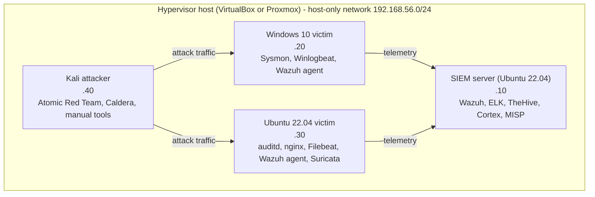
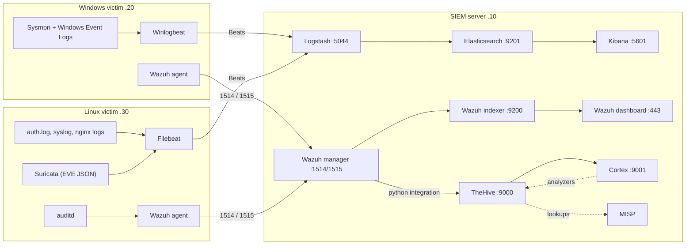

# Architecture Overview

## Goals

This lab is designed to simulate a small-to-medium enterprise Security Operations Center with:

- **Centralised log collection** from Windows, Linux, and network devices
- **Host-based intrusion detection** via Wazuh agents
- **Network intrusion detection** via Suricata on the Linux victim VM
- **Threat intelligence** enrichment via MISP
- **Case management** and semi-automated response via TheHive + Cortex

---

## Design Principles

1. **Visibility over complexity** — every component should produce observable, queryable data
2. **Defence in depth** — multiple detection layers (host + network + application)
3. **Reproducibility** — all configurations are version-controlled and can rebuild from scratch
4. **ATT&CK alignment** — every detection rule references a technique; coverage gaps are explicit

---

## Component Roles

| Component | Layer | Role |
|-----------|-------|------|
| Wazuh Manager | Management | Receives agent data, runs host-based rules, FIM, vuln scanning |
| Wazuh Agents | Host | Collect OS events, auditd, Sysmon, forward to manager |
| Elasticsearch | Storage | Backend index for all log data |
| Logstash | Pipeline | Enrichment, parsing, routing before indexing |
| Kibana | Visualisation | Dashboards, alert review, KQL/EQL queries |
| Suricata | Network | NIDS in IDS mode on the Linux victim VM (EVE JSON shipped by Filebeat) |
| Zeek | Network | Planned: metadata extraction (DNS, HTTP, SSL, conn logs); no setup guide yet |
| Filebeat | Agent | Ships Linux and nginx logs to Logstash |
| Winlogbeat | Agent | Ships Windows Event Logs to Logstash |
| TheHive | IR | Case management, alert aggregation, task tracking |
| Cortex | IR | Automated observable analysis (IP reputation, file hash, etc.) |
| MISP | Threat Intel | IoC management, feed consumption, ATT&CK mapping |

---

## Network Topology

All VMs sit on a **host-only** network. Only the SIEM server gets a second NAT adapter, used for package installation
(disable it afterwards, see [setup step 01](../setup/01-proxmox-setup.md)).

---

## Data Flow

Two parallel pipelines are deliberate: the Wazuh pipeline (agent -> manager -> indexer -> dashboard) handles host detections and
alerting, while the standalone ELK pipeline (Beats -> Logstash -> Elasticsearch -> Kibana) holds raw logs for hunting and
dashboards. Ports for the two stacks are separated (9200 vs 9201) so both fit on one host.

### Ports at a glance

| Service | Port | Where it is configured |
|---------|------|------------------------|
| Wazuh agent to manager | 1514 (UDP/TCP), 1515 (enrolment) | [02](../setup/02-siem-server.md), [03](../setup/03-wazuh-install.md) |
| Wazuh indexer | 9200 | [04](../setup/04-elk-install.md) |
| Standalone Elasticsearch | 9201 (transport 9301) | [04](../setup/04-elk-install.md) |
| Logstash Beats input | 5044 | [04](../setup/04-elk-install.md) |
| Kibana | 5601 | [04](../setup/04-elk-install.md) |
| Wazuh dashboard | 443 | [03](../setup/03-wazuh-install.md) |
| TheHive / Cortex | 9000 / 9001 | [06](../setup/06-thehive-misp.md) |
| MISP | 443 (see known gaps) | [06](../setup/06-thehive-misp.md) |

---

## Known Gaps and Inconsistencies

These come from reading the documents against each other, not from running the lab:

- **Port 443 is claimed twice.** The Wazuh dashboard and MISP (default web install) both use 443 on the SIEM host. One of them
  needs a different port or a reverse proxy.
- **Zeek is listed but has no setup guide.** It appears in the stack table and in the SOC-090 rule idea, but no guide installs it.
- **Suricata placement differs between documents.** Setup guide 05 runs Suricata on the Linux victim; older text in this file
  described a dedicated sensor. The diagrams above follow the setup guide.
- **The 12 GB SIEM VM is an estimate.** Wazuh, a second Elasticsearch, Logstash, Kibana, TheHive (Cassandra), Cortex and MISP on
  one 12 GB VM has not been measured and is likely tight.

## Hardware Requirements

| Resource | Minimum | Recommended |
|----------|---------|-------------|
| RAM | 24 GB | 32+ GB |
| CPU | 6 cores | 8+ cores |
| Storage | 200 GB SSD | 500 GB SSD |

### VM Allocation

| VM | RAM | vCPU | Disk |
|----|-----|------|------|
| SIEM Server | 12 GB | 4 | 100 GB |
| Windows Victim | 4 GB | 2 | 60 GB |
| Linux Victim | 2 GB | 2 | 40 GB |
| Kali Attacker | 4 GB | 2 | 60 GB |

---

## Security Considerations

- All inter-VM traffic stays on host-only network
- Wazuh agent communication is encrypted (TLS)
- Elasticsearch is intended to be reachable only from the lab network (ufw rules in setup guide 02); xpack security is
  disabled on the standalone Elasticsearch for the lab (see setup guide 04), which is not acceptable outside a lab
- Kibana and TheHive are meant to be reached only from the lab network (ufw rules in setup guide 02)
- No credentials are stored in this repository (see `.gitignore` and `.env.example`)

---

## Related Documents

- [ADR-001: Why Wazuh over pure OSSEC](adr/ADR-001-wazuh-over-ossec.md)
- [ADR-002: Why TheHive for case management](adr/ADR-002-thehive-case-management.md)
- [ADR-003: Sigma as canonical rule format](adr/ADR-003-sigma-canonical-format.md)
